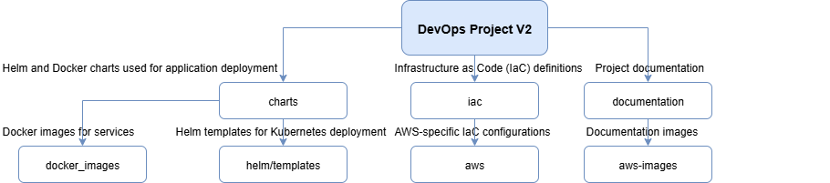

# DevOps Project v2 Documentation

| Documentation | Description |
|------|-------------|
| `documentation/aws.md` | Aws testing and finalv3 deployment explanations |
| `documentation/csrf-cors.md` | Learning about csrf and cors security mechanisms |
| `documentation/helm.md` | Helm testing explanations |

# DevOps Project V2 Infrastructure

| Path | Description |
|------|-------------|
| `charts` | Helm and Docker charts used for application deployment |
| `charts/docker_images` | Docker images for services |
| `charts/helm/templates` | Helm templates for Kubernetes deployment |
| `documentation` | Project documentation |
| `documentation/aws-images` | Documentation images |
| `iac` | Infrastructure as Code (IaC) definitions |
| `iac/aws` | AWS-specific IaC configurations |

