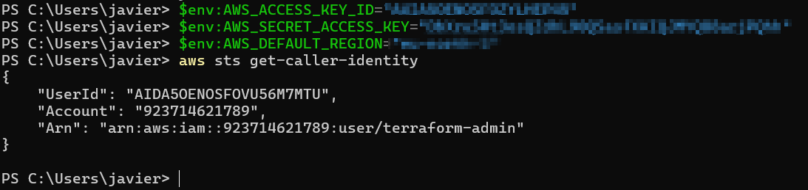
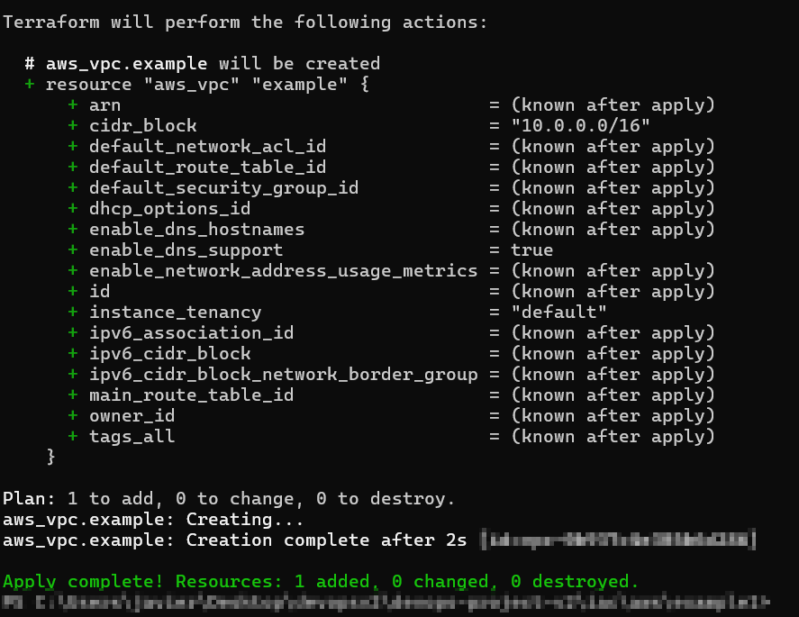
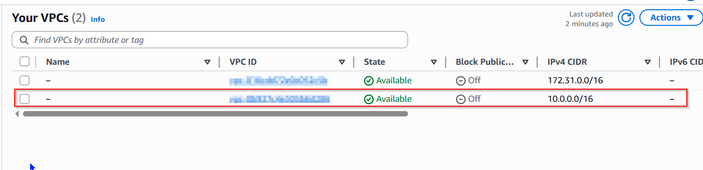
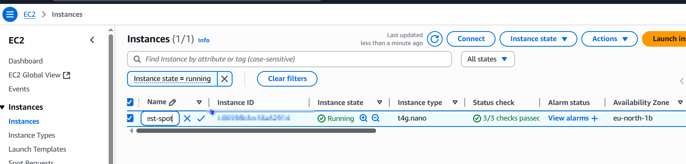
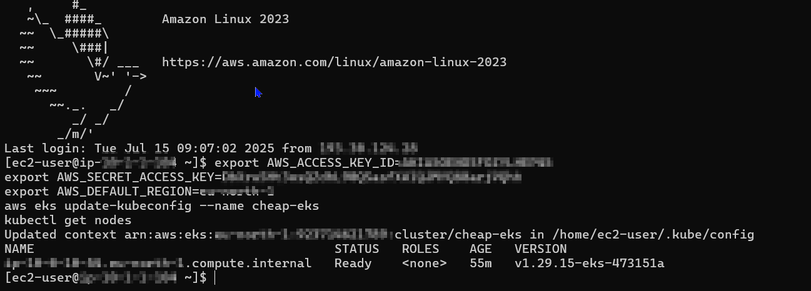
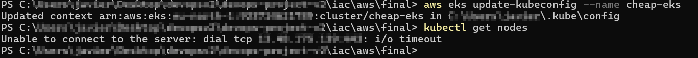

## terraform to aws connection

First we need a aws account, you will need a credit or debit card, then you will continue the following steps:

oficial documentation: https://docs.aws.amazon.com/cli/latest/userguide/getting-started-install.html

### INSTALL AWS CLI

```powershell
msiexec.exe /i https://awscli.amazonaws.com/AWSCLIV2.msi
```

### CREATE IAM USER WITH ADMIN PERMS

#### First in aws portal

open cloudshell and then

create user

```powershell
aws iam create-user --user-name terraform-admin
```

add admin rights

```powershell
aws iam attach-user-policy --user-name terraform-admin --policy-arn arn:aws:iam::aws:policy/AdministratorAccess
```

Create access keys

```powershell
aws iam create-access-key --user-name terraform-admin```
```

If we lose the secretkey

```powershell
# list accesskeys to obtain the id of the old key
aws iam list-access-keys --user-name terraform-admin

# delete access key
aws iam delete-access-key --user-name terraform-admin --access-key-id 12345

# and then create again
aws iam create-access-key --user-name terraform-admin```
```

#### then in local powershell

Add environment vars

```powershell
$env:AWS_ACCESS_KEY_ID="accesskeyid"
$env:AWS_SECRET_ACCESS_KEY="accesskey"
$env:AWS_DEFAULT_REGION="your-region" 
```

Whoami

```powershell
aws sts get-caller-identity
```



## example 1 vpc

```powershell

terraform init
terraform plan
terraform apply -auto-approve

```



VPC > Your VPCs



REMEMBER TO EXECUTE TERRAFORM DESTROY FOR DONT WASTE MONEY

## example 2 ec2

```powershell

terraform init
terraform plan
terraform apply -auto-approve

```

execute powershell script `connection.ps1`

```powershell
    powershell -ExecutionPolicy Bypass -File .\connection.ps1

    #if an old key already exists, remove it
    rm C:\Users\user\.ssh\id_rsa
    #and execute the script again
```



Instances > EC2


REMEMBER TO EXECUTE TERRAFORM DESTROY FOR DONT WASTE MONEY

## example 3 EKS 

```powershell

terraform init
terraform plan
terraform apply -auto-approve

```

https://developer.hashicorp.com/terraform/tutorials/kubernetes/eks

i modified the tutorial for waste less money

Explanation of the code:

| Step | Description                                                                                                                                                                                                                      |
|-------|----------------------------------------------------------------------------------------------------------------------------------------------------------------------------------------------------------------------------------|
| 1     | Create the VPC.                                                                                                                                                                                                                  |
| 2     | Create the Internet Gateway (IGW) and attach it to the VPC.                                                                                                                                                                      |
| 3     | Create 2 public subnets in the VPC, and apply special Kubernetes tags for service discovery and load balancer integration.                                                                                                       |
| 4     | Create a route table associated with the VPC.                                                                                                                                                                                   |
| 5     | Create a route in the new route table that points to the IGW created earlier; this allows the public subnets to access the internet.                                                                                            |
| 6     | Associate the new route table with the public subnets created earlier.                                                                                                                                                           |
| 7     | Create an IAM role for the EKS cluster, assigning a trust policy allowing the `eks.amazonaws.com` service to assume this role (this role allows the EKS control plane to manage AWS resources on your behalf).                    |
| 8     | Create the EKS cluster with the following options: <br> - Name: `cheap-eks` <br> - Version: `1.29` (a recent stable Kubernetes version at the time, to support latest features and security updates) <br> - Using the IAM role created earlier <br> - Using the VPC public subnets created earlier <br> - Endpoint public access enabled (to allow API access over the internet) |
| 9     | Create an IAM role for the node group (this role is different from the cluster role because it is assumed by the worker nodes, allowing them to interact with AWS services such as EC2, ECR, and the VPC networking).              |
| 10    | Create an EKS managed node group (this is different from the EKS cluster itself—while the cluster is the Kubernetes control plane managed by AWS, the node group consists of the worker EC2 instances that run your workloads; in AWS EKS, this separation is explicit, whereas in Azure AKS, node management is often more abstracted and integrated). |
| 11    | Define outputs to display connection information such as the cluster endpoint and cluster name for easy access.                                                                                                                 |

```powershell

aws eks --region eu-north-1 update-kubeconfig --name $(terraform output -raw cluster_name)

```

## final EKS 

the objetive is to do the following:

SSH into the VM (which is in vm_vpc).

From that VM, you can use kubectl to access the EKS API endpoint.

Your PC (outside that VPC CIDR) cannot connect directly to the API.

You can create/manage K8s resources only from the VM

In the VM is already installed all the tools needed for k8s
thanks to the script `setup.sh` allocated with the terraform files

for that, we use the resources that i created before, adding the peering between the 2 vpcs and SG to pass traffic between them

```powershell

terraform init
terraform plan
terraform apply -auto-approve

```

then when all is created, execute the powershell script for the connection

```powershell
    powershell -ExecutionPolicy Bypass -File .\connection.ps1

    #if an old key already exists, remove it
    rm C:\Users\user\.ssh\id_rsa
    #and execute the script again
```

And finally, execute the following commands to test if the eks cluster is working

```
export AWS_ACCESS_KEY_ID=xxx
export AWS_SECRET_ACCESS_KEY=xxx
export AWS_DEFAULT_REGION=xxx
aws eks update-kubeconfig --name cheap-eks
kubectl get nodes
```



If we try from our PC we will get timeout error




