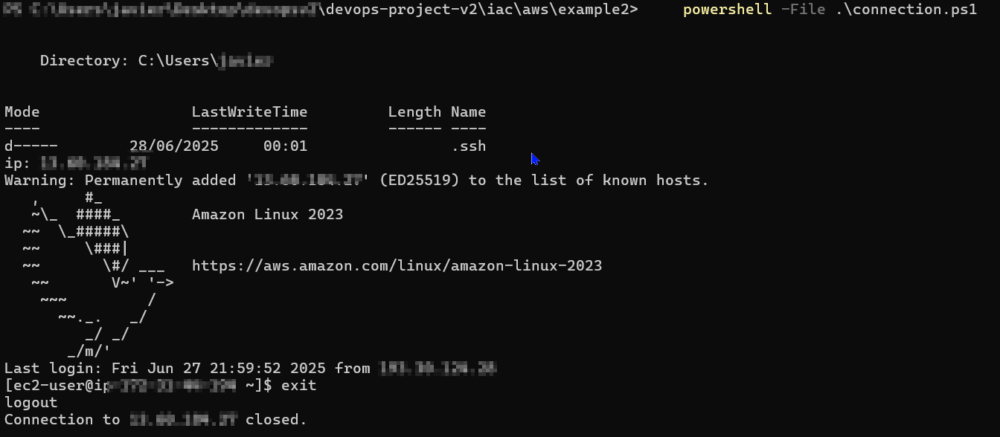

## terraform to aws connection

First we need an AWS account; you will need a credit or debit card. Then you will continue the following steps:

official documentation: https://docs.aws.amazon.com/cli/latest/userguide/getting-started-install.html

### INSTALL AWS CLI

```powershell
msiexec.exe /i https://awscli.amazonaws.com/AWSCLIV2.msi
```

### CREATE IAM USER WITH ADMIN PERMS

#### First in AWS portal

open CloudShell and then

create user

```powershell
aws iam create-user --user-name terraform-admin
```

add admin rights

```powershell
aws iam attach-user-policy --user-name terraform-admin --policy-arn arn:aws:iam::aws:policy/AdministratorAccess
```

Create access keys

```powershell
aws iam create-access-key --user-name terraform-admin
```

If we lose the secret key

```powershell
# list access keys to obtain the ID of the old key
aws iam list-access-keys --user-name terraform-admin

# delete access key
aws iam delete-access-key --user-name terraform-admin --access-key-id 12345

# and then create again
aws iam create-access-key --user-name terraform-admin
```

#### then in local PowerShell

Add environment vars

```powershell
$env:AWS_ACCESS_KEY_ID="accesskeyid"
$env:AWS_SECRET_ACCESS_KEY="accesskey"
$env:AWS_DEFAULT_REGION="your-region" 
```

Whoami

```powershell
aws sts get-caller-identity
```


## example 1 vpc

```powershell
terraform init
terraform plan
terraform apply -auto-approve
```


VPC > Your VPCs


REMEMBER TO EXECUTE TERRAFORM DESTROY TO AVOID WASTING MONEY

## example 2 ec2

```powershell
terraform init
terraform plan
terraform apply -auto-approve
```

execute PowerShell script `connection.ps1`

```powershell
powershell -ExecutionPolicy Bypass -File .\connection.ps1

#if an old key already exists, remove it
rm C:\Users\user\.ssh\id_rsa
#and execute the script again
```


Instances > EC2



REMEMBER TO EXECUTE TERRAFORM DESTROY TO AVOID WASTING MONEY

## example 3 EKS 

```powershell
terraform init
terraform plan
terraform apply -auto-approve
```

https://developer.hashicorp.com/terraform/tutorials/kubernetes/eks

i modified the tutorial to waste less money

Explanation of the code:

| Step | Description |
|------|-------------|
| 1    | Create the VPC |
| 2    | Create the Internet Gateway (IGW) and attach it to the VPC |
| 3    | Create 2 public subnets in the VPC, and apply special Kubernetes tags for service discovery and load balancer integration |
| 4    | Create a route table associated with the VPC |
| 5    | Create a route in the new route table that points to the IGW created earlier; this allows the public subnets to access the internet |
| 6    | Associate the new route table with the public subnets created earlier |
| 7    | Create an IAM role for the EKS cluster |
| 8    | Create the EKS cluster using the IAM role and subnets created earlier |
| 9    | Create an IAM role for the node group |
| 10   | Create an EKS managed node group |
| 11   | Define outputs to display connection info |

```powershell
aws eks --region eu-north-1 update-kubeconfig --name $(terraform output -raw cluster_name)
```

## final EKS 

SSH into the VM (which is in vm_vpc).  
From that VM, use kubectl to access the EKS API endpoint.  
Your PC (outside that VPC CIDR) cannot connect directly to the API.  
You can create/manage K8s resources only from the VM.  
The VM has all the tools installed for k8s (via `setup.sh`).

Run:

```powershell
terraform init
terraform plan
terraform apply -auto-approve
```

Then execute PowerShell connection script:

```powershell
powershell -ExecutionPolicy Bypass -File .\connection.ps1

#if an old key already exists, remove it
rm C:\Users\user\.ssh\id_rsa
#and execute the script again
```

Test if the EKS cluster is working:

```bash
export AWS_ACCESS_KEY_ID=xxx
export AWS_SECRET_ACCESS_KEY=xxx
export AWS_DEFAULT_REGION=xxx
aws eks update-kubeconfig --name cheap-eks
kubectl get nodes
```


If we try from our PC we get timeout error:


## final v2

Now the Terraform infrastructure is more complex, so let’s analyze the file to understand what we are creating.

We automate the installation of binaries via RPM.  
To create RPMs, we use FPM.

```bash
sudo yum install nano -y
mkdir docker-rpm-build
sudo dnf install -y ruby ruby-devel gcc make rpm-build
sudo dnf groupinstall -y "Development Tools"
sudo gem install --no-document fpm
cd docker-rpm-build
nano create.sh
```

Check where AWS is installed:

```bash
which aws
rpm -qf /usr/bin/aws
rpm -ql awscli-2-2.25.0-1.amzn2023.0.1.noarch | head -n 200
rpm -e aws
```

Use script `awsrpmcreator.sh` in `/iac/aws/finalv2/bin`

Thanks to https://www.intelligentdiscovery.io/controls/eks/eks-inbound-port-443 for help solving EKS private endpoint issues.

## final v3

```bash
aws sts get-caller-identity
aws eks update-kubeconfig --region eu-north-1 --name my-private-eks
kubectl get nodes
kubectl get svc
```

TODO: Explain all

---

The final v3 code is composed of 5 modules:

### Compute Module:
Creates the admin VM and jumpbox VM with the SSH keys.

### Endpoints:
Creates valid endpoints for the jumpbox to reach AWS services (necessary to use `aws eks get-token`).

### EKS:
Creates the EKS cluster and adds the IAM roles.

### IAM:
Creates the following roles:

- **eks_cluster_role**:  
  - Trusted by `eks.amazonaws.com`  
  - Attached policy: `AmazonEKSClusterPolicy`

- **jumpbox_role**:  
  - Trusted by `ec2.amazonaws.com`  
  - Attached policies:  
    - `AmazonEKSClusterPolicy`  
    - `AmazonEKSWorkerNodePolicy`  
    - `AmazonEKSVPCResourceController`

    


