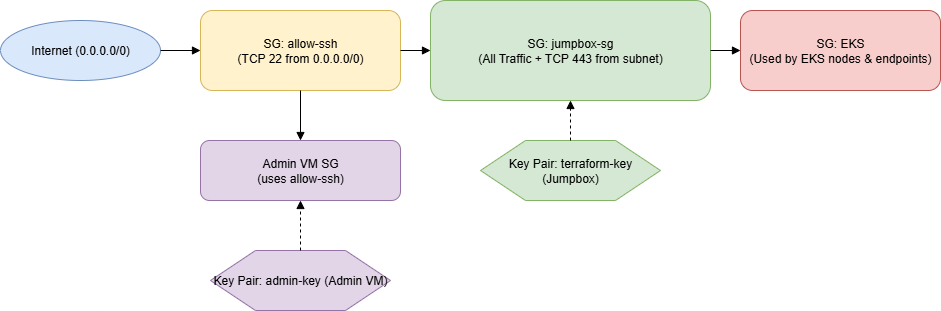

## terraform to aws connection

First we need an AWS account; you will need a credit or debit card. Then you will continue the following steps:

official documentation: https://docs.aws.amazon.com/cli/latest/userguide/getting-started-install.html

### INSTALL AWS CLI

```powershell
msiexec.exe /i https://awscli.amazonaws.com/AWSCLIV2.msi
```

### CREATE IAM USER WITH ADMIN PERMS

#### First in AWS portal

open CloudShell and then

create user

```powershell
aws iam create-user --user-name terraform-admin
```

add admin rights

```powershell
aws iam attach-user-policy --user-name terraform-admin --policy-arn arn:aws:iam::aws:policy/AdministratorAccess
```

Create access keys

```powershell
aws iam create-access-key --user-name terraform-admin
```

If we lose the secret key

```powershell
# list access keys to obtain the ID of the old key
aws iam list-access-keys --user-name terraform-admin

# delete access key
aws iam delete-access-key --user-name terraform-admin --access-key-id 12345

# and then create again
aws iam create-access-key --user-name terraform-admin
```

#### then in local PowerShell

Add environment vars

```powershell
$env:AWS_ACCESS_KEY_ID="accesskeyid"
$env:AWS_SECRET_ACCESS_KEY="accesskey"
$env:AWS_DEFAULT_REGION="your-region" 
```

Whoami

```powershell
aws sts get-caller-identity
```


## example 1 vpc

```powershell
terraform init
terraform plan
terraform apply -auto-approve
```


VPC > Your VPCs


REMEMBER TO EXECUTE TERRAFORM DESTROY TO AVOID WASTING MONEY

## example 2 ec2

```powershell
terraform init
terraform plan
terraform apply -auto-approve
```

execute PowerShell script `connection.ps1`

```powershell
powershell -ExecutionPolicy Bypass -File .\connection.ps1

#if an old key already exists, remove it
rm C:\Users\user\.ssh\id_rsa
#and execute the script again
```


Instances > EC2


REMEMBER TO EXECUTE TERRAFORM DESTROY TO AVOID WASTING MONEY

## example 3 EKS 

```powershell
terraform init
terraform plan
terraform apply -auto-approve
```

https://developer.hashicorp.com/terraform/tutorials/kubernetes/eks

i modified the tutorial to waste less money

Explanation of the code:

| Step | Description |
|------|-------------|
| 1    | Create the VPC |
| 2    | Create the Internet Gateway (IGW) and attach it to the VPC |
| 3    | Create 2 public subnets in the VPC, and apply special Kubernetes tags for service discovery and load balancer integration |
| 4    | Create a route table associated with the VPC |
| 5    | Create a route in the new route table that points to the IGW created earlier; this allows the public subnets to access the internet |
| 6    | Associate the new route table with the public subnets created earlier |
| 7    | Create an IAM role for the EKS cluster |
| 8    | Create the EKS cluster using the IAM role and subnets created earlier |
| 9    | Create an IAM role for the node group |
| 10   | Create an EKS managed node group |
| 11   | Define outputs to display connection info |

```powershell
aws eks --region eu-north-1 update-kubeconfig --name $(terraform output -raw cluster_name)
```

## final EKS 

SSH into the VM (which is in vm_vpc).  
From that VM, use kubectl to access the EKS API endpoint.  
Your PC (outside that VPC CIDR) cannot connect directly to the API.  
You can create/manage K8s resources only from the VM.  
The VM has all the tools installed for k8s (via `setup.sh`).

Run:

```powershell
terraform init
terraform plan
terraform apply -auto-approve
```

Then execute PowerShell connection script:

```powershell
powershell -ExecutionPolicy Bypass -File .\connection.ps1

#if an old key already exists, remove it
rm C:\Users\user\.ssh\id_rsa
#and execute the script again
```

Test if the EKS cluster is working:

```bash
export AWS_ACCESS_KEY_ID=xxx
export AWS_SECRET_ACCESS_KEY=xxx
export AWS_DEFAULT_REGION=xxx
aws eks update-kubeconfig --name cheap-eks
kubectl get nodes
```


If we try from our PC we get timeout error:


## final v2

FIRST, HERE WE HAVE ALL THE PACKAGES IN [AMAZON LINUX 2023](https://docs.aws.amazon.com/linux/al2023/release-notes/all-packages-AL2023.8.html)
Now the Terraform infrastructure is more complex, so let’s analyze the file to understand what we are creating.

We automate the installation of binaries via RPM.  
To create RPMs, we use FPM.

```bash
sudo yum install nano -y
mkdir docker-rpm-build
sudo dnf install -y ruby ruby-devel gcc make rpm-build
sudo dnf groupinstall -y "Development Tools"
sudo gem install --no-document fpm
cd docker-rpm-build
nano create.sh
```

Check where AWS is installed:

```bash
which aws
rpm -qf /usr/bin/aws
rpm -ql awscli-2-2.25.0-1.amzn2023.0.1.noarch | head -n 200
rpm -e aws
```

Use script `awsrpmcreator.sh` in `/iac/aws/finalv2/bin`

Thanks to https://www.intelligentdiscovery.io/controls/eks/eks-inbound-port-443 for help solving EKS private endpoint issues.

PSQL rpm obtain

```cmd
dnf download postgresql15
dnf download postgresql15-private-libs
```

tar and untar files

TAR
tar -czvf backup.tar.gz /home/ubuntu/project
UNTAR
tar -xzvf archive-name.tar.gz


## final v3

commands (in jumpbox for test it works)

```bash
aws sts get-caller-identity
aws eks update-kubeconfig --region eu-north-1 --name my-private-eks
kubectl get nodes
kubectl get svc
```

The objetive of the finalv3 is to create the following AWS infraestructure


The final v3 code is composed of 5 modules:


And the flow between then is the following:


The deployment starts with module.network and module.iam, which are independent and run in parallel.

The module.security depends on the network module and is created next. Then, module.eks is deployed, relying on both the IAM and security modules. Following that, module.compute depends on the EKS module and is created.

Simultaneously, module.endpoints depends on the network module. Finally, all outputs are generated after the compute module completes.

Now lets see all the modules one by one:


### Compute Module:
Creates the admin VM and jumpbox VM with the SSH keys.


We are using [aws_ami data source](https://registry.terraform.io/providers/hashicorp/aws/latest/docs/data-sources/ami) to get the ID of Amazon Linux OS to use it in the [EC2 creations](https://registry.terraform.io/providers/hashicorp/aws/latest/docs/resources/instance)


### Endpoints:
Creates valid endpoints for the jumpbox to reach AWS services (necessary to use `aws eks get-token`).


I define a local variable interface_services containing the required service names, including:

| **Endpoint**             | **Purpose**                                                                                 |
|--------------------------|---------------------------------------------------------------------------------------------|
| `eks`                    | allows private access to the EKS API (cluster provisioning and management)             |
| `eks-auth`               | Enables token-based IAM authentication to the EKS cluster                                  |
| `ec2`                    | required for EC2 metadata operations             |
| `sts`                    | Needed for AWS IAM roles to assume other roles        |
| `logs`                   | Enables access to CloudWatch Logs for logging and monitoring from inside the VPC           |
| `ecr.api`                | Amazon ECR API (listing or describing images)          |
| `ecr.dkr`                | required to pull container images from Amazon ECR Docker registry                          |
| `elasticloadbalancing`   | Allows internal access to the ELB API for managing load balancers                          |


Using for_each, I loop through this list to dynamically create an aws_vpc_endpoint resource for each service.

All endpoints are tagged accordingly with Name = "vpce-${each.key}" for easy identification.

by default access to AWS services (like EKS, STS, or ECR) goes over the public internet. But in a private subnet, there is no internet route which breaks that access.

Interface VPC Endpoints solve this by:

Creating an elastic network interface (ENI) in your private subnet.

mapping the service DNS (like sts.amazonaws.com) to that internal ENI using Private DNS

Routing traffic from your EC2 instances through that ENI directly to the AWS service, over the AWS internal network (not the internet).

securing access with Security group just like you would with instances

Ss when the jumpbox instance inside the private subnet tries to run aws sts get-caller-identity, it resolves sts.amazonaws.com to the private IP of the VPC endpoint and reaches STS internally 

[Terraform documentation](https://registry.terraform.io/providers/hashicorp/aws/latest/docs/resources/vpc_endpoint) [AWS documentation](https://docs.aws.amazon.com/vpc/latest/privatelink/create-interface-endpoint.html)

### EKS:
Creates the EKS cluster and adds the IAM roles.


aws_eks_cluster is needed to create the actual eks control plane, which is the heart of the kubernetes cluster
it need a name, a role for permissions, and a kubernetes version.

vpc_config is required so the control plane can talk to your network (via subnets and security group)
you choose if the api endpoint is public or private based on your security needs

the kubernetes provider is needed so terraform can connect to the new eks cluster and manage kubernetes resources
it uses the clusters endpoint and certificate, and authenticates with aws eks get-token — this avoids manual kubeconfig steps

the kubernetes_config_map resource creates the aws-auth configmap in kube-system
this is required for allowing iam roles (like admins or a jumpbox role) to actually access the cluster
without this configmap, no one (even admins) can use kubectl or access the cluster

you dont need more resources because eks manages the control plane for you

- [Terraform documentation](https://registry.terraform.io/providers/hashicorp/aws/latest/docs/resources/eks_cluster)

- [aws documentation](https://docs.aws.amazon.com/eks/latest/userguide/create-cluster.html)

### Security:


responsible for controlling access, protecting resources, and enforcing secure communication between components



it uses security groups to filter inbound and outbound traffic
each sg defines rules by ip, port, and protocol
key pairs are used for secure ssh access to vms
admin and jumpbox have different key pairs and
users connect to the jumpbox or admin vm, not directly to eks, on the other hand
only approved paths and sources are allowed between components.

internet access is restricted to specific ports like ssh or https
communication between services happens over private channels
the goal is to enforce least privilege and reduce attack surface.

- [AWS Security Groups overview (AWS VPC User Guide)](https://docs.aws.amazon.com/vpc/latest/userguide/vpc-security-groups.html)
- [Security group rule basics and examples (AWS EC2 User Guide)](https://docs.aws.amazon.com/vpc/latest/userguide/security-group-rules.html)
- [Terraform `aws_security_group` resource (Terraform AWS Provider)](https://registry.terraform.io/providers/hashicorp/aws/latest/docs/resources/security_group)


### Network:

the network module creates a vpc with public and private subnets, an internet gateway, and optional nat gateway for private subnet internet access.


the network module sets up a vpc with three subnets: one public subnet called admin, which gets public ip addresses and connects directly to the internet via an internet gateway. 

the other two are private subnets for eks, which dont have public ips and normally route internet traffic through a nat gateway. 

but the nat gateway is commented out here because maybe the eks nodes use vpc endpoints instead, so they don’t need internet access.

this setup keeps the jumpbox private and secure, while the admin subnet can be accessed from outside if needed

[Terraform documentation](https://registry.terraform.io/providers/hashicorp/aws/latest/docs/resources/vpc)

[aws documentation](https://docs.aws.amazon.com/vpc/latest/userguide/vpc-getting-started.html)

### IAM:
Creates the following roles:

- **eks_cluster_role**:  
  - Trusted by `eks.amazonaws.com`  
  - Attached policy: `AmazonEKSClusterPolicy`

- **jumpbox_role**:  
  - Trusted by `ec2.amazonaws.com`  
  - Attached policies:  
    - `AmazonEKSClusterPolicy`  
    - `AmazonEKSWorkerNodePolicy`  
    - `AmazonEKSVPCResourceController`


Lets explain the [IAM module](../iac/aws/finalv3/modules/iam/main.tf) with [terraform guide](https://registry.terraform.io/providers/hashicorp/aws/latest/docs/resources/iam_role)


First of all, we are going to create iam roles, not iam users, the reason is because 
user and roles use policies for authorization. Keep in mind that user and role can't do anything until you allow certain actions with a policy.

Answer the following questions and you will differentiate between a user and a role:

Can have a password? Yes-> user, No-> role
Can have an access key? Yes-> user, No-> role
Can belong to a group? Yes-> user, No -> role
Can be associated with AWS resources (for example EC2 instances)? No-> user, Yes->role

this explanation is extracted from [stackoverflow](https://stackoverflow.com/a/48182754)

Okay, so, we are going to use EC2 instances so thats the reason about why iam role and not iam user

The resource `aws_iam_role` is composed with the following content:

```terraform
resource "aws_iam_role" "eks_cluster_role" {
  name = "eksClusterRole"
  assume_role_policy = jsonencode({
    Version = "2012-10-17",
    Statement = [{
      Effect = "Allow",
      Principal = { Service = "eks.amazonaws.com" },
      Action = "sts:AssumeRole"
    }]
  })
}
```

there can be more options, but lets focus with the basic:

Name: to clasify the role with a name

[assume_role_policy](https://docs.aws.amazon.com/IAM/latest/UserGuide/id_roles_create_for-service.html): (Required) Policy that grants an entity permission to assume the role, the entity is the resource from aws that we are configuring to bring access or privileges

We always have `Version`, `Statement` and inside `Statement`: `Effect`, `Action` and `Resource`


Version
- Always "2012-10-17" for IAM policies.
- It is the version of the policy language.
- This field is required.

Statement
- An array of one or more permission statements.
- Each statement includes the effect, principal, and actions.

Effect
- Can be either "Allow" or "Deny".
- In trust policies, it is usually "Allow" to permit the specified principal to assume the role.

Principal
- Specifies who can assume the role.
- Can be a service (e.g., "eks.amazonaws.com") or an AWS account/user/role.
- This field is essential because it links the role to a trusted entity.

Action
- Must be "sts:AssumeRole" in trust policies.
- Grants the specified principal permission to assume the role using AWS STS (Security Token Service).

Resource
- Not used in trust (assume role) policies.
- The resource is implicitly the role to which the trust policy is attached.

Then when we have defined the roles, now we need to attach them with a IAM Policy:

```terraform
resource "aws_iam_role_policy_attachment" "eks_cluster" {
  role       = aws_iam_role.jumpbox_role.name
  policy_arn = "arn:aws:iam::aws:policy/AmazonEKSClusterPolicy"
}
```

This resource only have two arguments, and all are Required, the argument `role` that reference the name of the IAM role, and the `policy_arn` that refers to the [Amazon Resource Name](https://docs.aws.amazon.com/IAM/latest/UserGuide/reference-arns.html) that uniquely identifies the policy, in this case it refers to the [AmazonEKSClusterPolicy](https://docs.aws.amazon.com/aws-managed-policy/latest/reference/AmazonEKSClusterPolicy.html)

Finally we use an [IAM Instance Profile](https://docs.aws.amazon.com/IAM/latest/UserGuide/id_roles_use_switch-role-ec2_instance-profiles.html) to pass an IAM role to an EC2 instance.

```terraform
resource "aws_iam_instance_profile" "jumpbox_profile" {
  name = "jumpboxInstanceProfile"
  role = aws_iam_role.jumpbox_role.name
}
```

we can see another options in the [terraform documentation](https://registry.terraform.io/providers/hashicorp/aws/latest/docs/resources/iam_instance_profile)

We have 3 outputs:

```terraform
output "eks_cluster_role_arn" {
  value = aws_iam_role.eks_cluster_role.arn
}

output "jumpbox_role_arn" {
  value = aws_iam_role.jumpbox_role.arn
}

output "jumpbox_profile" {
  value = aws_iam_instance_profile.jumpbox_profile.name
}
```

# RPMS

Terraform infraestructure focus on generate the RPMS file with only one VM

# RDS

this terraform code deploy a postgresql rds database in aws for local testing like with minikube
it use the default vpc and create a security group alowing inbound traffic on port 5432 from anywhere
the rds instance run postgresql version 14.18 with a small db.t3.micro instance type and 20 gb storage
public accesibility is enable so the database can be reached from outside aws
it skip creating a final snapshot and disable deletion protection for easy teardown
the username is postgres and the password is password (not recomended for production)
tags are set for identify the security group and the database
the security group allow all egress traffic so the database can do outbound conections if needed
the output give a full postgresql conection string with credentials host port and database name
sensitive output make sure the conection string is hide in normal terraform output logs

LOAD SQL SCRIPT

psql -h host -U postgres -d final_project -f .\init.sql


# JUMPBOX

This infraestructure provisions an `Admin VM` in a public subnet and a `Jumpbox VM` in a private subnet within the same VPC.  
It is used to test how a jumpbox works

## How It Works

Two RSA key pairs are created via the `tls` provider, but in the finalv3 proyect with only one is good too
- `admin_id_rsa` for Admin VM login.
- `jumpbox_id_rsa` for Jumpbox VM login.

`user_data` in Admin VM copies the Jumpbox key into `/home/ec2-user/.ssh/` and sets correct permissions.

With the jumpbox.ps1 and connection.ps1 we will connect into the different machines.
From the root of your Terraform project (where this module is integrated):

```bash
terraform init
terraform apply -auto-approve
```

Then run the PowerShell script from your local machine to connect to the Jumpbox through the admin VM.

# ECR


first install [aws tools for powershell](https://docs.aws.amazon.com/powershell/v5/userguide/ps-installing-awstools.html)

Open powershell with administrator rights

execute the following commands

Install-Module -Name AWS.Tools.Installer


Next install the ECR module

Install-AWSToolsModule AWS.Tools.ECR -CleanUp


Finally lets install the module for bring use to all users not only with admin rights

Install-AWSToolsModule AWS.Tools.IdentityManagement -Scope AllUsers


Okay, so this doesnt work too, the reason is that Powershell doesnt support to get the password and do a docker login in the same command, but i decided to leave here for if i needed in the future.
Firs we have another problem, and its called Windows Credential Manager, which has a token length limit that breaks with long AWS SSO tokens. 

renaming or deleting docker-credential-wincred.exe prevents Docker from using it, and removing the credStore or credsStore keys in the Docker config file tells Docker to skip the credential helper entirely. As a result, credentials are saved directly in the config.json file in plain text, which avoids the token length limit but is less secure. This allows long SSO tokens to work so that docker login succeeds, but at the cost of storing passwords unencrypted.

https://forums.docker.com/t/using-awss-ecr-get-login-password-and-password-stdin-with-powershell/125349/7
https://stackoverflow.com/questions/60807697/docker-login-error-storing-credentials-the-stub-received-bad-data

DOCKER LOGIN

```powershell
cmd /c "aws ecr-public get-login-password --region us-east-1 | docker login --username AWS --password-stdin public.ecr.aws/url"
```


but we have the problem that its less secure, in a production project this cant be a solution, u must apply a docker-credential-ecr-login or some credential helper, plain text secrets are not alowed in the real work

DOCKER PUSH

*url = repo unique id

```powershell
docker tag public.ecr.aws/url/myapp-django:1.0.0 public.ecr.aws/url/reponame:x
```

```powershell
docker push public.ecr.aws/url/reponame:x
```

DOCKER PULL

```powershell
docker pull public.ecr.aws/url/reponame:x
```


DOCKER LOGOUT

```powershell
docker logout
```

HELM LOGIN

```powershell
cmd /c "aws ecr-public get-login-password --region us-east-1 | helm registry login --username AWS --password-stdin public.ecr.aws/url"
```


UPLOAD CHART

``` powershell
helm package .
```

ITS NECESARY A REPO WITH THE SAME NAME AS THE CHART


```powershell
helm push coches-0.1.0.tgz oci://public.ecr.aws/url
```


HELM PULL

```powershell
helm pull oci://public.ecr.aws/url/coches --version 0.1.0
```

HELM Logout

```powershell
Helm registry logout public.ecr.aws/url
```


# PRIVATE ECR

Now that we are using the ADMIN/Jumpbox infraestructure we dont have the powershell problem, so we simply run the following commands:

```cmd
powershell -ExecutionPolicy Bypass -File .\jumpbox.ps1

aws ecr get-login-password --region eu-north-1 | docker login --username AWS --password-stdin id.dkr.ecr.eu-north-1.amazonaws.com

aws ecr get-login-password --region eu-north-1 | helm registry login --username AWS --password-stdin id.dkr.ecr.eu-north-1.amazonaws.com
```


Now lets explain a little bit the infraestructure


We part from the jumpbox infraestructure, and we simply add the scripts for install docker and helm into the jumpbox and the private ecrs, with a new vpc endpoint to access into it and IAM rules for private ECR

## IAM

The IAM role, named `jumpbox-ecr-role` is designed for the jumpbox and allows the EC2 service to assume this role, so any EC2 instance with this role attached can get temporary AWS credentials without storing access keys locally.

The IAM policy, named `jumpbox-ecr-policy` grants the jumpbox the ability to work with specific Amazon ECR repositories called `cars` and `docker` and it allows the instance to authenticate to ECR by getting an authorization token and then perform actions needed to pull and push container images or helm charts

## VPC ENDPOINTS

this configuration creates VPC interface endpoints that allow private connectivity from the jumpboxs subnet to Amazon ECR and AWS STS without using the public internet

each endpoint is deployed inside the main VPC, associated with the jumpbox subnet, and protected by the jumpbox’s security group. Private DNS is enabled so that standard service names resolve to these private connections instead of public ones. This setup ensures that the jumpbox can authenticate with STS interact with the ECR API and push or pull images from ECR through the AWS internal networ

# PRIVATE RDS

This module have the objetive to test private RDS connections with postgresql v14 engine and postgres v15 client

Get secrets

```cmd
aws secretsmanager get-secret-value --secret-id 'private_postgres_master_secret_arn' --query 'SecretString' --output text
```


TEST the connection (best option, in the capture there is another option with env vars)

```cmd
psql --host=host --port=5432 --username=username --dbname=postgres
```


LOAD SQL SCRIPT

psql -h host -U user -d postgres -f init.sql


# S3

S3 bucket is an AWS storage, in this case it will be used to storage terraform.tfstate, to control if already exists the S3 bucket i am going to use imports first, here is a flow chart to understand the steps


# Import the S3 bucket into Terraform
terraform import aws_s3_bucket.tf_state tfstate-devopsv2-abcd

# Import the DynamoDB table into Terraform
terraform import aws_dynamodb_table.tf_locks terraform-locks-abcd

# my eks and arc setup on aws with terraform - complete walkthrough

alright so this is my COMPLETE terraform setup for creating a private eks cluster with github actions runner controller. ive been working on this for weeks, dealing with all sorts of weird aws errors and timeout issues. let me walk you through everything were building here, piece by piece, with all the gritty details.

## what were actually building here

the main idea was to create a COMPLETELY private eks cluster that can run github actions runners in a secure way. i didnt want anything exposed to the internet, but still needed some way to actually manage the cluster. so weve got this jumpbox ec2 instance that acts as our gateway to everything.

the whole thing is in a vpc with proper networking - public and private subnets across three availability zones because high availability is IMPORTANT even for test environments. you never know when one availability zone might decide to take a nap, right?

## starting with the providers block

first things first - we gotta declare all the terraform providers were gonna use:

the aws provider is obvious - were building on aws infrastructure. the tls provider is for generating ssh keys so we can actually access our jumpbox. kubectl lets us apply kubernetes manifests directly from terraform which is pretty slick. docker is for building and pushing our custom runner image to ecr.

i pinned the versions so that future updates dont break my setup. ive been burned by that before where terraform updates and suddenly nothing works anymore. not gonna happen this time.

## the networking stuff - vpc and subnets

ok so the networking part is CRUCIAL for this whole thing to work properly. were creating a vpc with 10.0.0.0/16 cidr block:

see those enable_dns options? theyre important for eks to work right. without dns support, your pods wont be able to resolve internal addresses and everything just falls apart. learned that the hard way when my pods couldnt talk to each other.

then we create the subnets - three public and three private across different azs. the public subnets have map_public_ip_on_launch set to false which is a security thing. we dont want instances getting public ips automatically. the private subnets dont even have this option because theyre, well, private.

each subnet gets a descriptive name so we can actually tell what's what in the aws console. ive made the mistake of not naming things properly and then spending hours trying to figure out which subnet is which.

## internet and nat gateways

for internet access, we need an internet gateway for the public subnets. this is what allows resources in public subnets to talk to the internet.

and a nat gateway for the private subnets to access the internet. the nat gateway needs an elastic ip and lives in a public subnet. the depends_on makes sure the igw exists before we try to create the nat gateway - terraform doesnt always get the order right on its own.

the nat gateway is one of the more expensive parts of this setup, but we need it because the nodes in private subnets need to pull container images and stuff from the internet.

## route tables - how traffic actually flows

route tables control where traffic goes in our vpc. we have one public route table that routes to the internet gateway:

and separate route tables for each private subnet that route to the nat gateway. this is a bit more work than having one route table for all private subnets, but it gives us more control and is better practice.

this setup means instances in private subnets can reach the internet for updates and pulling images but cant be reached from the internet directly. its like they can make outbound calls but cant receive incoming calls.

## iam roles - who can do what

iam is SUPER important for security in aws. we create roles for the eks cluster and nodes:

the cluster role lets the eks control plane manage aws resources on our behalf. we attach the amazoneksclusterpolicy to it which gives it the permissions it needs.

for the nodes, we create another role that gets three policies attached: amazoneksworkernodepolicy, amazoneks_cni_policy, and amazonecrcontainerregistryreadonly. these let the nodes join the cluster, handle networking, and pull images from ecr.

iam roles are way better than using access keys because theyre temporary and managed by aws. no more worrying about rotated credentials or leaked keys.

## the actual eks cluster

now for the main event - the eks cluster itself:

see how its in the private subnets? thats what makes it private. both endpoint types are enabled, but since its in private subnets, the public endpoint isnt really accessible from the internet unless youre in the vpc.

we disable logging to save costs, but in production you might want to enable this for audit purposes. the depends_on makes sure the cluster role has the right policies before trying to create the cluster.

## node group - the workers

the node group defines the actual worker nodes that will run our pods:

we use t3.medium instances because theyre a good balance of cost and performance. al2023 is the latest amazon linux version. 20gb disks give us enough space for most workloads.

the scaling config starts with 1 node but can go up to 2 if needed. the update config allows one node to be unavailable during updates so we dont take down the whole cluster.

the depends_on is important here - it makes sure the node role has all the necessary policies before trying to create the nodes.

## eks addons - cluster functionality

we install several addons for cluster functionality:

coredns for dns resolution within the cluster. without this, your pods cant find each other by name. kube-proxy handles network routing between pods. vpc-cni integrates with aws networking. pod-identity-agent enables irsa which is way better than using access keys. cert-manager handles ssl certificates.

these addons are ESSENTIAL for a working cluster. ive tried running without some of them and its not pretty.

## setting up kubernetes providers

to manage kubernetes resources from terraform, we need to configure the providers:

this sets up authentication with our eks cluster using aws eks get-token. its much cleaner than trying to manage kubeconfig files manually.

the exec configuration tells terraform how to get authentication tokens using the aws cli. this is the recommended way to authenticate with eks.

## actions runner controller namespace

we create a dedicated namespace for arc:

namespaces help keep things organized in kubernetes. were putting all the arc stuff in its own namespace so it doesnt interfere with other workloads.

the depends_on makes sure the node group and addons are ready before we try to create the namespace. terraform doesnt always get the order right, especially with kubernetes resources.

## arc helm release

we install arc using helm:

helm makes it easy to install complex applications like arc. we point it to the official chart repository and tell it to install in our arc namespace.

the wait and timeout options are important because helm installations can take a while. without these, terraform might timeout before the installation completes.

## aws auth configmap

this is CRUCIAL for allowing our nodes and jumpbox to access the cluster:

the aws-auth configmap maps aws iam roles to kubernetes users and groups. this is how we control who can access what in our cluster.

we map our node role to the system:nodes group so the nodes can join the cluster. we also map our ec2 role to system:masters so our jumpbox can administer the cluster.

## oidc setup for irsa

we set up oidc for irsa which allows pods to assume iam roles:

this is way more secure than using access keys because the credentials are temporary and managed by aws. we create an oidc provider for our cluster and then create roles that can be assumed by service accounts.

the thumbprint comes from the clusters oidc issuer certificate. we have to wait for the oidc issuer to be ready before we can create the provider.

## arc runner role

we create a special role for arc runners:

this role can be assumed by pods in our arc namespace using the my-runner-sa service account. we give it s3 full access for this example, but in production youd want to be more restrictive.

irsa is one of the coolest features of eks - it lets us grant aws permissions to pods without storing credentials in the cluster.

## arc runner helm release

we install our custom runner configuration:

this uses our own helm chart with custom values. we point it to our ecr image and set the service account to use our irsa role.

the depends_on makes sure everything is ready before we try to install the runners. helm can be finicky about dependencies.

## ecr repository

we create a private ecr repository for our custom runner image:

ecr is aws's container registry. its secure and integrates well with eks. we set image_tag_mutability to mutable so we can update the latest tag.

force_delete is set to true so terraform can delete the repository even if it contains images. be careful with this in production.

## ecr authentication

we get an ecr auth token and create a kubernetes secret:

this secret allows our pods to authenticate with ecr and pull images. without this, they wouldnt be able to pull our custom runner image.

the auth token is temporary and managed by aws, which is more secure than using long-lived credentials.

## docker image build process

we build and push our custom runner image:

this is a three-step process: login to ecr, build the image, and push it. we use null resources with local-exec to run docker commands.

the docker build includes specific versions of the runner and runner-container-hooks. we use --no-cache to ensure we get a fresh build every time.

## ec2 jumpbox security group

we create a security group for our jumpbox:

this allows ssh access from anywhere (which might not be ideal for production) and http/https access. the egress rule allows outbound traffic to anywhere.

security groups are stateful, so we dont need to explicitly allow return traffic.

## ec2 iam role

we create a role for our jumpbox:

this role allows the ec2 service to assume it. we attach several policies that give the jumpbox access to eks, ecr, and ec2.

the jumpbox needs these permissions to manage our eks cluster and pull images from ecr.

## ec2 key pair

we generate an ssh key pair for accessing the jumpbox:

the tls_private_key resource generates a new key pair. we then create an aws key pair from the public key.

the private key is outputted by terraform so we can use it to ssh into the jumpbox. we mark it as sensitive so it doesnt show in logs.

## ec2 instance

finally, we create the jumpbox instance:

we use the latest amazon linux 2 ami. the instance is placed in a public subnet with a public ip. we attach our security group and iam instance profile.

the key_name references our key pair so we can ssh into the instance. the depends_on ensures the route table association exists before creating the instance.

## outputs

we output useful information:

the ec2 instance id, public ip, and security group id. the private key is outputted as sensitive. we also output vpc and subnet ids for reference.

the eks cluster name and node group name are outputted for use in other scripts or terraform configurations.

## connecting to the cluster

to access the cluster, you need to ssh into the jumpbox:

from your local machine, you cant directly access the cluster because its private. you have to go through the jumpbox. this is a security feature, not a bug.

on the jumpbox, you can configure aws credentials and then run aws eks update-kubeconfig to get access to the cluster.

## troubleshooting tips

ive run into plenty of issues with this setup:

oidc provider not being ready is a common one. we have a null resource that waits for it, but sometimes it still isnt ready.

docker build failures can happen if docker isnt installed or running on the machine where you run terraform.

ecr permissions issues if the node role doesnt have permission to pull images.

kubectl connection issues if the aws credentials or region arent set correctly.

## cost considerations

this setup isnt exactly cheap:

the nat gateway costs about $32 per month plus data processing fees.

the eks cluster costs about $73 per month for the control plane.

the ec2 instances cost depends on the type and how many you run.

the eip costs about $3.60 per month if its not attached to a resource.

data transfer costs can add up if youre moving a lot of data.

## security considerations

security was a big focus:

private eks cluster with no public api access.

nodes in private subnets with no public ips.

minimal iam permissions using roles and policies.

oidc integration for service accounts.

no hardcoded credentials - everything uses iam roles.

ssh access only through jumpbox.

## improvements for production

for production, id make a few changes:

restrict ssh access to specific ip addresses.

enable cluster logging for audit trails.

use more restrictive network policies.

implement pod security standards.

use smaller instance types and scale as needed.

consider using spot instances for non-production workloads.

## conclusion

this terraform setup creates a complete, secure environment for running github actions runners on eks. it includes all the necessary components from networking to iam to kubernetes resources.

the architecture follows best practices for security with private subnets, minimal permissions, and secure access patterns. while there are areas that could be improved for production use, this provides a solid foundation for running workloads in a secure manner.

the automation with terraform means we can recreate this environment consistently across different regions or accounts. this is invaluable for development, testing, and production environments.

remember to always test thoroughly and consider your specific requirements before deploying to production. what works for one use case might not be appropriate for another.