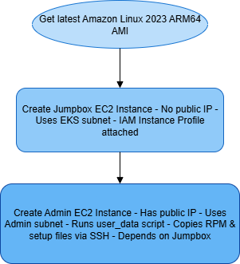

## terraform to aws connection

First we need an AWS account; you will need a credit or debit card. Then you will continue the following steps:

official documentation: https://docs.aws.amazon.com/cli/latest/userguide/getting-started-install.html

### INSTALL AWS CLI

```powershell
msiexec.exe /i https://awscli.amazonaws.com/AWSCLIV2.msi
```

### CREATE IAM USER WITH ADMIN PERMS

#### First in AWS portal

open CloudShell and then

create user

```powershell
aws iam create-user --user-name terraform-admin
```

add admin rights

```powershell
aws iam attach-user-policy --user-name terraform-admin --policy-arn arn:aws:iam::aws:policy/AdministratorAccess
```

Create access keys

```powershell
aws iam create-access-key --user-name terraform-admin
```

If we lose the secret key

```powershell
# list access keys to obtain the ID of the old key
aws iam list-access-keys --user-name terraform-admin

# delete access key
aws iam delete-access-key --user-name terraform-admin --access-key-id 12345

# and then create again
aws iam create-access-key --user-name terraform-admin
```

#### then in local PowerShell

Add environment vars

```powershell
$env:AWS_ACCESS_KEY_ID="accesskeyid"
$env:AWS_SECRET_ACCESS_KEY="accesskey"
$env:AWS_DEFAULT_REGION="your-region" 
```

Whoami

```powershell
aws sts get-caller-identity
```


## example 1 vpc

```powershell
terraform init
terraform plan
terraform apply -auto-approve
```


VPC > Your VPCs


REMEMBER TO EXECUTE TERRAFORM DESTROY TO AVOID WASTING MONEY

## example 2 ec2

```powershell
terraform init
terraform plan
terraform apply -auto-approve
```

execute PowerShell script `connection.ps1`

```powershell
powershell -ExecutionPolicy Bypass -File .\connection.ps1

#if an old key already exists, remove it
rm C:\Users\user\.ssh\id_rsa
#and execute the script again
```


Instances > EC2


REMEMBER TO EXECUTE TERRAFORM DESTROY TO AVOID WASTING MONEY

## example 3 EKS 

```powershell
terraform init
terraform plan
terraform apply -auto-approve
```

https://developer.hashicorp.com/terraform/tutorials/kubernetes/eks

i modified the tutorial to waste less money

Explanation of the code:

| Step | Description |
|------|-------------|
| 1    | Create the VPC |
| 2    | Create the Internet Gateway (IGW) and attach it to the VPC |
| 3    | Create 2 public subnets in the VPC, and apply special Kubernetes tags for service discovery and load balancer integration |
| 4    | Create a route table associated with the VPC |
| 5    | Create a route in the new route table that points to the IGW created earlier; this allows the public subnets to access the internet |
| 6    | Associate the new route table with the public subnets created earlier |
| 7    | Create an IAM role for the EKS cluster |
| 8    | Create the EKS cluster using the IAM role and subnets created earlier |
| 9    | Create an IAM role for the node group |
| 10   | Create an EKS managed node group |
| 11   | Define outputs to display connection info |

```powershell
aws eks --region eu-north-1 update-kubeconfig --name $(terraform output -raw cluster_name)
```

## final EKS 

SSH into the VM (which is in vm_vpc).  
From that VM, use kubectl to access the EKS API endpoint.  
Your PC (outside that VPC CIDR) cannot connect directly to the API.  
You can create/manage K8s resources only from the VM.  
The VM has all the tools installed for k8s (via `setup.sh`).

Run:

```powershell
terraform init
terraform plan
terraform apply -auto-approve
```

Then execute PowerShell connection script:

```powershell
powershell -ExecutionPolicy Bypass -File .\connection.ps1

#if an old key already exists, remove it
rm C:\Users\user\.ssh\id_rsa
#and execute the script again
```

Test if the EKS cluster is working:

```bash
export AWS_ACCESS_KEY_ID=xxx
export AWS_SECRET_ACCESS_KEY=xxx
export AWS_DEFAULT_REGION=xxx
aws eks update-kubeconfig --name cheap-eks
kubectl get nodes
```


If we try from our PC we get timeout error:


## final v2

Now the Terraform infrastructure is more complex, so let’s analyze the file to understand what we are creating.

We automate the installation of binaries via RPM.  
To create RPMs, we use FPM.

```bash
sudo yum install nano -y
mkdir docker-rpm-build
sudo dnf install -y ruby ruby-devel gcc make rpm-build
sudo dnf groupinstall -y "Development Tools"
sudo gem install --no-document fpm
cd docker-rpm-build
nano create.sh
```

Check where AWS is installed:

```bash
which aws
rpm -qf /usr/bin/aws
rpm -ql awscli-2-2.25.0-1.amzn2023.0.1.noarch | head -n 200
rpm -e aws
```

Use script `awsrpmcreator.sh` in `/iac/aws/finalv2/bin`

Thanks to https://www.intelligentdiscovery.io/controls/eks/eks-inbound-port-443 for help solving EKS private endpoint issues.

## final v3

commands (in jumpbox for test it works)

```bash
aws sts get-caller-identity
aws eks update-kubeconfig --region eu-north-1 --name my-private-eks
kubectl get nodes
kubectl get svc
```

The objetive of the finalv3 is to create the following AWS infraestructure


The final v3 code is composed of 5 modules:


And the flow between then is the following:


The deployment starts with module.network and module.iam, which are independent and run in parallel.

The module.security depends on the network module and is created next. Then, module.eks is deployed, relying on both the IAM and security modules. Following that, module.compute depends on the EKS module and is created.

Simultaneously, module.endpoints depends on the network module. Finally, all outputs are generated after the compute module completes.

Now lets see all the modules one by one:


### Compute Module:
Creates the admin VM and jumpbox VM with the SSH keys.



We are using [aws_ami data source](https://registry.terraform.io/providers/hashicorp/aws/latest/docs/data-sources/ami) to get the ID of Amazon Linux OS to use it in the [EC2 creations](https://registry.terraform.io/providers/hashicorp/aws/latest/docs/resources/instance)


### Endpoints:
Creates valid endpoints for the jumpbox to reach AWS services (necessary to use `aws eks get-token`).


I define a local variable interface_services containing the required service names, including:

| **Endpoint**             | **Purpose**                                                                                 |
|--------------------------|---------------------------------------------------------------------------------------------|
| `eks`                    | allows private access to the EKS API (cluster provisioning and management)             |
| `eks-auth`               | Enables token-based IAM authentication to the EKS cluster                                  |
| `ec2`                    | required for EC2 metadata operations             |
| `sts`                    | Needed for AWS IAM roles to assume other roles        |
| `logs`                   | Enables access to CloudWatch Logs for logging and monitoring from inside the VPC           |
| `ecr.api`                | Amazon ECR API (listing or describing images)          |
| `ecr.dkr`                | required to pull container images from Amazon ECR Docker registry                          |
| `elasticloadbalancing`   | Allows internal access to the ELB API for managing load balancers                          |


Using for_each, I loop through this list to dynamically create an aws_vpc_endpoint resource for each service.

All endpoints are tagged accordingly with Name = "vpce-${each.key}" for easy identification.

by default access to AWS services (like EKS, STS, or ECR) goes over the public internet. But in a private subnet, there is no internet route which breaks that access.

Interface VPC Endpoints solve this by:

Creating an elastic network interface (ENI) in your private subnet.

mapping the service DNS (like sts.amazonaws.com) to that internal ENI using Private DNS

Routing traffic from your EC2 instances through that ENI directly to the AWS service, over the AWS internal network (not the internet).

securing access with Security group just like you would with instances

Ss when the jumpbox instance inside the private subnet tries to run aws sts get-caller-identity, it resolves sts.amazonaws.com to the private IP of the VPC endpoint and reaches STS internally 

[Terraform documentation](https://registry.terraform.io/providers/hashicorp/aws/latest/docs/resources/vpc_endpoint) [AWS documentation](https://docs.aws.amazon.com/vpc/latest/privatelink/create-interface-endpoint.html)

### EKS:
Creates the EKS cluster and adds the IAM roles.


aws_eks_cluster is needed to create the actual eks control plane, which is the heart of the kubernetes cluster
it need a name, a role for permissions, and a kubernetes version.

vpc_config is required so the control plane can talk to your network (via subnets and security group)
you choose if the api endpoint is public or private based on your security needs

the kubernetes provider is needed so terraform can connect to the new eks cluster and manage kubernetes resources
it uses the clusters endpoint and certificate, and authenticates with aws eks get-token — this avoids manual kubeconfig steps

the kubernetes_config_map resource creates the aws-auth configmap in kube-system
this is required for allowing iam roles (like admins or a jumpbox role) to actually access the cluster
without this configmap, no one (even admins) can use kubectl or access the cluster

you dont need more resources because eks manages the control plane for you

- [Terraform documentation](https://registry.terraform.io/providers/hashicorp/aws/latest/docs/resources/eks_cluster)

- [aws documentation](https://docs.aws.amazon.com/eks/latest/userguide/create-cluster.html)

### Security:


responsible for controlling access, protecting resources, and enforcing secure communication between components


it uses security groups to filter inbound and outbound traffic
each sg defines rules by ip, port, and protocol
key pairs are used for secure ssh access to vms
admin and jumpbox have different key pairs and
users connect to the jumpbox or admin vm, not directly to eks, on the other hand
only approved paths and sources are allowed between components.

internet access is restricted to specific ports like ssh or https
communication between services happens over private channels
the goal is to enforce least privilege and reduce attack surface.

- [AWS Security Groups overview (AWS VPC User Guide)](https://docs.aws.amazon.com/vpc/latest/userguide/vpc-security-groups.html)
- [Security group rule basics and examples (AWS EC2 User Guide)](https://docs.aws.amazon.com/vpc/latest/userguide/security-group-rules.html)
- [Terraform `aws_security_group` resource (Terraform AWS Provider)](https://registry.terraform.io/providers/hashicorp/aws/latest/docs/resources/security_group)


### Network:

the network module creates a vpc with public and private subnets, an internet gateway, and optional nat gateway for private subnet internet access.


the network module sets up a vpc with three subnets: one public subnet called admin, which gets public ip addresses and connects directly to the internet via an internet gateway. 

the other two are private subnets for eks, which dont have public ips and normally route internet traffic through a nat gateway. 

but the nat gateway is commented out here because maybe the eks nodes use vpc endpoints instead, so they don’t need internet access.

this setup keeps the jumpbox private and secure, while the admin subnet can be accessed from outside if needed

[Terraform documentation](https://registry.terraform.io/providers/hashicorp/aws/latest/docs/resources/vpc)

[aws documentation](https://docs.aws.amazon.com/vpc/latest/userguide/vpc-getting-started.html)

### IAM:
Creates the following roles:

- **eks_cluster_role**:  
  - Trusted by `eks.amazonaws.com`  
  - Attached policy: `AmazonEKSClusterPolicy`

- **jumpbox_role**:  
  - Trusted by `ec2.amazonaws.com`  
  - Attached policies:  
    - `AmazonEKSClusterPolicy`  
    - `AmazonEKSWorkerNodePolicy`  
    - `AmazonEKSVPCResourceController`


Lets explain the [IAM module](../iac/aws/finalv3/modules/iam/main.tf) with [terraform guide](https://registry.terraform.io/providers/hashicorp/aws/latest/docs/resources/iam_role)


First of all, we are going to create iam roles, not iam users, the reason is because 
user and roles use policies for authorization. Keep in mind that user and role can't do anything until you allow certain actions with a policy.

Answer the following questions and you will differentiate between a user and a role:

Can have a password? Yes-> user, No-> role
Can have an access key? Yes-> user, No-> role
Can belong to a group? Yes-> user, No -> role
Can be associated with AWS resources (for example EC2 instances)? No-> user, Yes->role

this explanation is extracted from [stackoverflow](https://stackoverflow.com/a/48182754)

Okay, so, we are going to use EC2 instances so thats the reason about why iam role and not iam user

The resource `aws_iam_role` is composed with the following content:

```terraform
resource "aws_iam_role" "eks_cluster_role" {
  name = "eksClusterRole"
  assume_role_policy = jsonencode({
    Version = "2012-10-17",
    Statement = [{
      Effect = "Allow",
      Principal = { Service = "eks.amazonaws.com" },
      Action = "sts:AssumeRole"
    }]
  })
}
```

there can be more options, but lets focus with the basic:

Name: to clasify the role with a name

[assume_role_policy](https://docs.aws.amazon.com/IAM/latest/UserGuide/id_roles_create_for-service.html): (Required) Policy that grants an entity permission to assume the role, the entity is the resource from aws that we are configuring to bring access or privileges

We always have `Version`, `Statement` and inside `Statement`: `Effect`, `Action` and `Resource`


Version
- Always "2012-10-17" for IAM policies.
- It is the version of the policy language.
- This field is required.

Statement
- An array of one or more permission statements.
- Each statement includes the effect, principal, and actions.

Effect
- Can be either "Allow" or "Deny".
- In trust policies, it is usually "Allow" to permit the specified principal to assume the role.

Principal
- Specifies who can assume the role.
- Can be a service (e.g., "eks.amazonaws.com") or an AWS account/user/role.
- This field is essential because it links the role to a trusted entity.

Action
- Must be "sts:AssumeRole" in trust policies.
- Grants the specified principal permission to assume the role using AWS STS (Security Token Service).

Resource
- Not used in trust (assume role) policies.
- The resource is implicitly the role to which the trust policy is attached.

Then when we have defined the roles, now we need to attach them with a IAM Policy:

```terraform
resource "aws_iam_role_policy_attachment" "eks_cluster" {
  role       = aws_iam_role.jumpbox_role.name
  policy_arn = "arn:aws:iam::aws:policy/AmazonEKSClusterPolicy"
}
```

This resource only have two arguments, and all are Required, the argument `role` that reference the name of the IAM role, and the `policy_arn` that refers to the [Amazon Resource Name](https://docs.aws.amazon.com/IAM/latest/UserGuide/reference-arns.html) that uniquely identifies the policy, in this case it refers to the [AmazonEKSClusterPolicy](https://docs.aws.amazon.com/aws-managed-policy/latest/reference/AmazonEKSClusterPolicy.html)

Finally we use an [IAM Instance Profile](https://docs.aws.amazon.com/IAM/latest/UserGuide/id_roles_use_switch-role-ec2_instance-profiles.html) to pass an IAM role to an EC2 instance.

```terraform
resource "aws_iam_instance_profile" "jumpbox_profile" {
  name = "jumpboxInstanceProfile"
  role = aws_iam_role.jumpbox_role.name
}
```

we can see another options in the [terraform documentation](https://registry.terraform.io/providers/hashicorp/aws/latest/docs/resources/iam_instance_profile)

We have 3 outputs:

```terraform
output "eks_cluster_role_arn" {
  value = aws_iam_role.eks_cluster_role.arn
}

output "jumpbox_role_arn" {
  value = aws_iam_role.jumpbox_role.arn
}

output "jumpbox_profile" {
  value = aws_iam_instance_profile.jumpbox_profile.name
}
```

# RPMS

Terraform infraestructure focus on generate the RPMS file with only one VM

# RDS

this terraform code deploy a postgresql rds database in aws for local testing like with minikube
it use the default vpc and create a security group alowing inbound traffic on port 5432 from anywhere
the rds instance run postgresql version 14.18 with a small db.t3.micro instance type and 20 gb storage
public accesibility is enable so the database can be reached from outside aws
it skip creating a final snapshot and disable deletion protection for easy teardown
the username is postgres and the password is password (not recomended for production)
tags are set for identify the security group and the database
the security group allow all egress traffic so the database can do outbound conections if needed
the output give a full postgresql conection string with credentials host port and database name
sensitive output make sure the conection string is hide in normal terraform output logs

# JUMPBOX

This infraestructure provisions an `Admin VM` in a public subnet and a `Jumpbox VM` in a private subnet within the same VPC.  
It is used to test how a jumpbox works

## How It Works

Two RSA key pairs are created via the `tls` provider, but in the finalv3 proyect with only one is good too
- `admin_id_rsa` for Admin VM login.
- `jumpbox_id_rsa` for Jumpbox VM login.

`user_data` in Admin VM copies the Jumpbox key into `/home/ec2-user/.ssh/` and sets correct permissions.

With the jumpbox.ps1 and connection.ps1 we will connect into the different machines.
From the root of your Terraform project (where this module is integrated):

```bash
terraform init
terraform apply -auto-approve
```

Then run the PowerShell script from your local machine to connect to the Jumpbox through the admin VM.

# ECR


first install [aws tools for powershell](https://docs.aws.amazon.com/powershell/v5/userguide/ps-installing-awstools.html)

Open powershell with administrator rights

execute the following commands

Install-Module -Name AWS.Tools.Installer


Next install the ECR module

Install-AWSToolsModule AWS.Tools.ECR -CleanUp


Finally lets install the module for bring use to all users not only with admin rights

Install-AWSToolsModule AWS.Tools.IdentityManagement -Scope AllUsers


