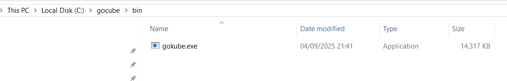
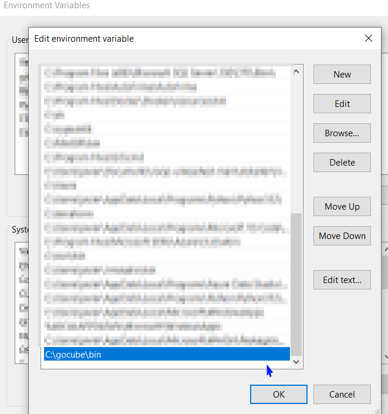
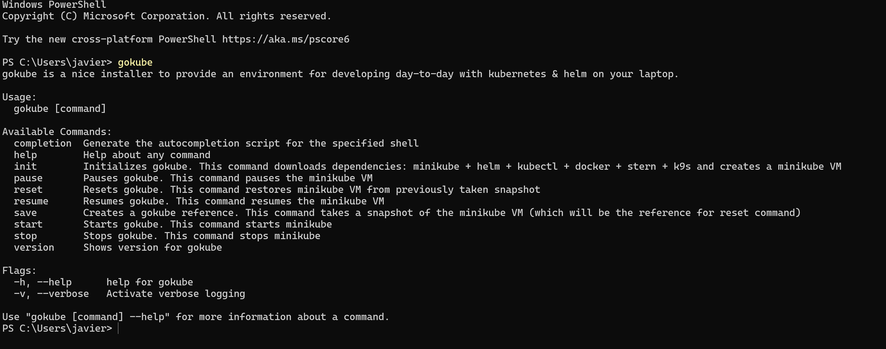
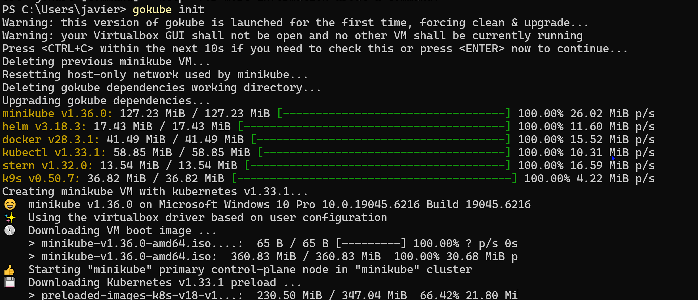

First of all, what is gokube:

gokube is a package developed by Thales that automates all the process of download the stack for minikube (docker, kubectl, minikube itself, helm)

how to install:

https://github.com/thalesgroup/gokube/releases/tag/v1.36.0

place the .exe file into a directory, in my case i followed the recomendations of gokube official documentation

And to use it without the need of write the path, its recommended to add it into env variables path module

To test that it works

Because i had virtualbox and hyper-v, i decided to use only vb, so y disabled hyper-v bcdedit /set hypervisorlaunchtype off

$env:MINIKUBE_CPUS="2"
$env:MINIKUBE_MEMORY="6144"

i decided to use that requirement because with the default my pc will explode