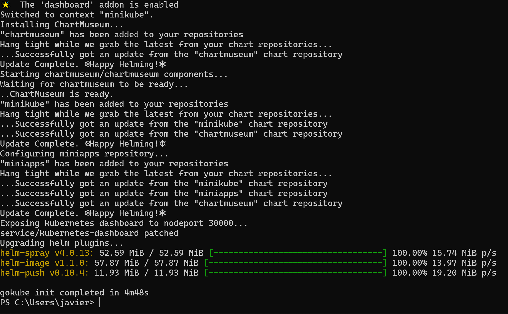

# What is Gokube?

**Gokube** is a package developed by **Thales** that automates the whole
process of downloading the stack for **Minikube**:\
- Docker\
- Kubectl\
- Minikube itself\
- Helm

------------------------------------------------------------------------

## How to Install

Download it here:\
[Gokube v1.36.0
Release](https://github.com/thalesgroup/gokube/releases/tag/v1.36.0)

Place the `.exe` file into a directory. In my case, I followed the
recommendations from the official Gokube documentation.


To use it without needing to write the path every time, it's recommended
to **add it to the environment variables PATH module**.


------------------------------------------------------------------------

## Testing Gokube

To test that it works:

\


------------------------------------------------------------------------

## Configuring Virtualization

Because I had **VirtualBox** and **Hyper-V**, I decided to use only
VirtualBox, so I disabled Hyper-V with the following command:

``` powershell
bcdedit /set hypervisorlaunchtype off
```

Then, I configured my Minikube resources:

``` powershell
$env:MINIKUBE_CPUS="2"
$env:MINIKUBE_MEMORY="6144"
```

I decided to use these requirements because with the default settings my
PC would explode haha.


