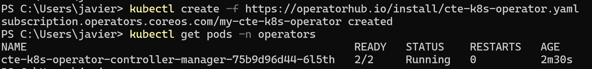

What is OLM?

OLM stands for Operator Lifecycle Manager.

It’s a Kubernetes component that help installing, managing and upgrading Operators in a cluster.

Think of it as an "app store + package manager" for Operators.

Why OLM instead of Helm?

Helm:

Installs application manifests (Deployments, Services, CRDs)

You’re in charge of upgrading and maintaining

OLM:

Designed specifically for operators.

Automates installation, upgrades, dependency resolution, and lifecycle management

A Kubernetes Operator is a method of packaging deploying and managing a kubernetes application

Is more than just a pod or deployment — it usually has its own configuration dependencieslifecycle management updates and scaling rules

An Operator extends Kubernetes with custom controllers + Custom Resource Definitions (CRDs).

[INSTALL OLM ](https://github.com/operator-framework/operator-lifecycle-manager)

```poweshell
kubectl create -f https://github.com/operator-framework/operator-lifecycle-manager/releases/download/v0.30.0/crds.yaml
kubectl create -f https://github.com/operator-framework/operator-lifecycle-manager/releases/download/v0.30.0/olm.yaml
kubectl create -f https://operatorhub.io/install/cte-k8s-operator.yaml
```


Test that olm is running

```powershell
kubectl get pods -n olm
```

NOW LETS TALK ABOUT CTE

[official operatorhub CTE](https://operatorhub.io/operator/cte-k8s-operator)

Ciphertrust transparent encryption is a tool 

kubectl create -f https://operatorhub.io/install/cte-k8s-operator.yaml



lets install now ciphertrust manager

https://www.thalestct.com/ciphertrust-data-security-platform/ce-for-vmware/


lets test it

```powershell
kubectl create ns cte-test
@"
apiVersion: v1
kind: Pod
metadata:
  name: nginx-cte
  namespace: cte-test
spec:
  containers:
  - name: nginx
    image: nginx:alpine
    volumeMounts:
    - mountPath: "/data"
      name: test-data
  volumes:
  - name: test-data
    emptyDir: {}
"@ | kubectl apply -f -
```

Install olm and a example with cte agent:

```terraform
data "http" "olm_crds" {
  url = "https://github.com/operator-framework/operator-lifecycle-manager/releases/download/v0.30.0/crds.yaml"
}

data "kubectl_file_documents" "olm_crds" {
  content = data.http.olm_crds.body
}

resource "kubectl_manifest" "olm_crds" {
  for_each           = data.kubectl_file_documents.olm_crds.manifests
  yaml_body          = each.value
  server_side_apply  = true
  apply_only = true
  force_new         = true
}

# -----------------------------
# OLM Core
# -----------------------------
data "http" "olm_core" {
  url = "https://github.com/operator-framework/operator-lifecycle-manager/releases/download/v0.30.0/olm.yaml"
}

data "kubectl_file_documents" "olm_core" {
  content = data.http.olm_core.body
}

resource "kubectl_manifest" "olm_core" {
  for_each           = data.kubectl_file_documents.olm_core.manifests
  yaml_body          = each.value
  server_side_apply  = true
  apply_only = true
  force_new         = true
  depends_on         = [kubectl_manifest.olm_crds]
}

# -----------------------------
# CTE Operator
# -----------------------------
data "http" "cte_operator" {
  url = "https://operatorhub.io/install/cte-k8s-operator.yaml"
}

data "kubectl_file_documents" "cte_operator" {
  content = data.http.cte_operator.body
}

resource "kubectl_manifest" "cte_operator" {
  for_each           = data.kubectl_file_documents.cte_operator.manifests
  yaml_body          = each.value
  server_side_apply  = true
  apply_only = true
  force_new         = true
  depends_on         = [kubectl_manifest.olm_core]
}
```

